<h1 align="center">Bonjour, je suis Leblond ! 👋</h1>

<i>Étudiant en Ingénierie Logicielle @ Atlas University | Passionné par .NET & la CyberSécurité</i>

<h3><code>amedeleblond@github ~ $ whoami</code></h3>
<!-- Les images sont placées l'une à côté de l'autre sans tableau -->

  

<h3><code>amedeleblond@github ~ $ ./contributions.sh</code></h3>

---

### 🚀 À propos de moi

- 🔭 Je me concentre actuellement sur l'approfondissement de mon expertise dans l'écosystème **.NET (ASP.NET Core, Entity Framework)** et la création d'intégrations **API REST**.
- 📱 Je développe également des applications **Flutter** (comme des plateformes LMS) intégrant des interfaces de tutorat par IA, avec des déploiements sur le Google Play Store et la Huawei AppGallery.
- 🔒 J'explore activement des concepts de **CyberSécurité** et de cryptographie (comme l'implémentation d'algorithmes de hachage SHA-256 et de chiffrements en Python) ainsi que l'administration réseau.
- 🌱 J'étudie l'ingénierie logicielle à l'**Université Atlas**.
- 💬 Je parle couramment français, je m'entraîne sur quelques expressions japonaises (*Arigato, Sumimasen !*), et j'aime collaborer sur des projets de conception interdisciplinaires.
- ⚡ **Fun fact :** J'éclate de rire quand je suis face à des difficultés !

---

### 🛠️ Tech Stack

**Langages :**  
`C#` `Java` `Python` `JavaScript` `C++` `C` `SQL` `PHP`

**Frameworks & Web :**  
`.NET` `ASP.NET Core` `React` `Next.js` `Node.js` `Laravel` `Django` `HTML5/CSS3`

**Outils, Cloud & DevOps :**  
`Docker` `Git/GitHub` `GitLab` `GitHub Actions` `Google Cloud` `Postman` `Figma` `Linux` `IntelliJ IDEA` `VS Code`

---

### 🔗 Me Contacter

  
  

